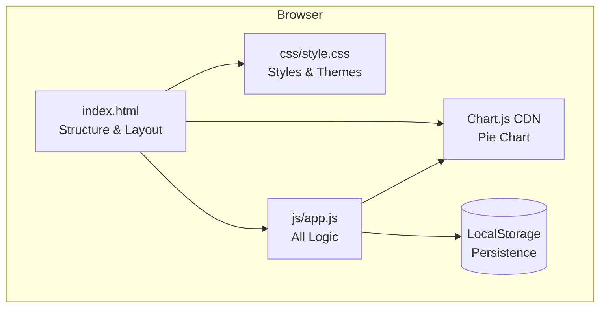
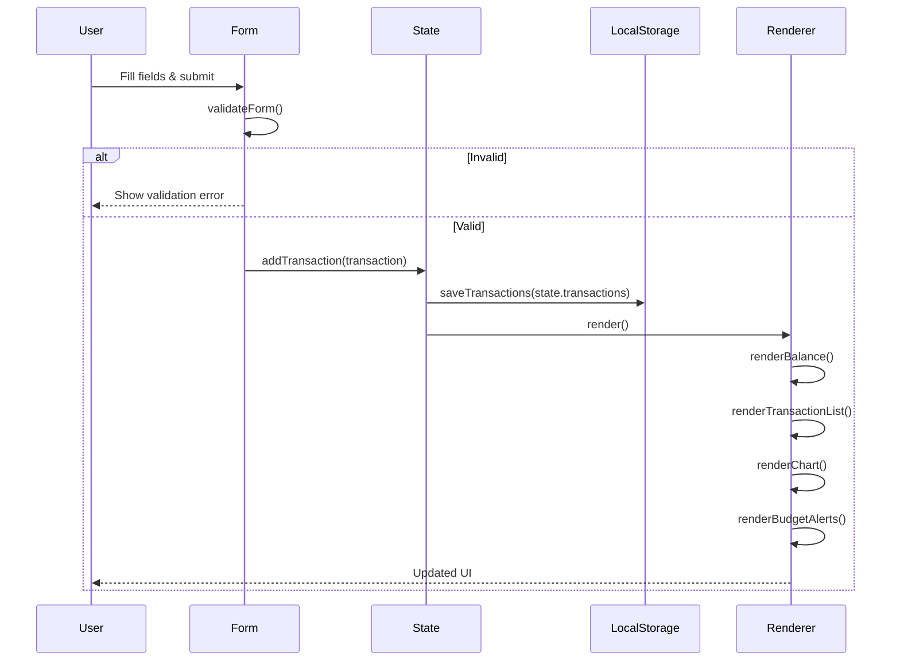
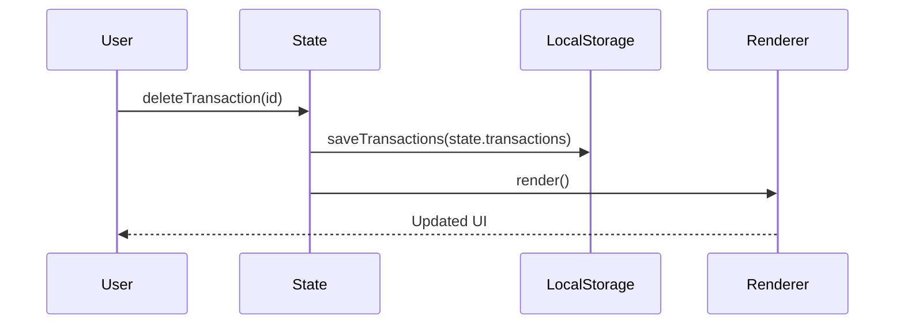
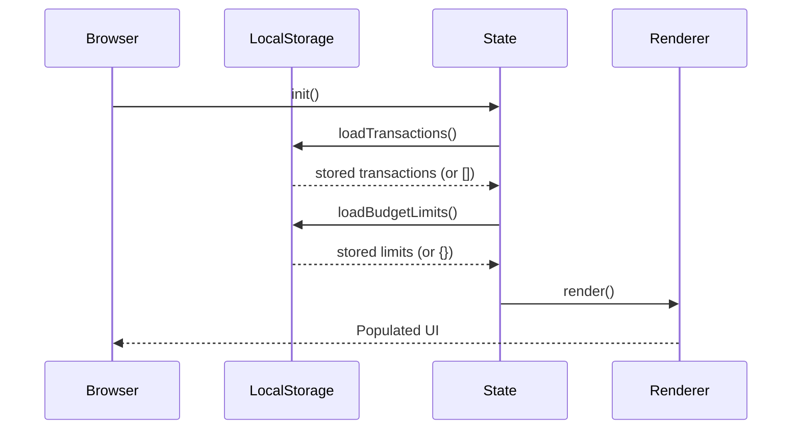

# Design Document: Expense & Budget Visualizer

## Overview

The Expense & Budget Visualizer is a mobile-friendly single-page web application built with plain HTML, CSS, and Vanilla JavaScript. It allows users to track daily spending by adding transactions with a name, amount, and category, then visualizes that data as a live-updating pie chart and running balance. All data is persisted in the browser's Local Storage — no server, no build step, no frameworks required.

The app also includes three optional enhancements: highlighting spending that exceeds a per-category budget limit, sorting the transaction list by amount or category, and a monthly summary view that groups spending by month.

---

## Architecture

The app is a single HTML page with one CSS file and one JavaScript file. There is no build pipeline or module bundler. The JavaScript is organized into logical sections (state management, storage, rendering, event handling) within a single file.



### File Structure

```
/
├── index.html
├── css/
│   └── style.css
└── js/
    └── app.js
```

---

## Sequence Diagrams

### Add Transaction Flow



### Delete Transaction Flow



### Page Load Flow



---

## Components and Interfaces

### Component 1: State Manager

**Purpose**: Single source of truth for all application data. Exposes pure functions to read and mutate state, then persists to LocalStorage.

**Interface**:
```typescript
interface Transaction {
  id: string           // UUID v4
  name: string         // item description
  amount: number       // positive float, 2 decimal places
  category: string     // one of the available categories
  date: string         // ISO 8601 date string (YYYY-MM-DD)
}

interface BudgetLimit {
  category: string
  limit: number        // monthly spending cap
}

interface AppState {
  transactions: Transaction[]
  budgetLimits: Record<string, number>
  categories: string[]
  sortBy: 'date' | 'amount-asc' | 'amount-desc' | 'category'
  activeView: 'main' | 'monthly'
}
```

**Responsibilities**:
- Hold all transactions and budget limits in memory
- Provide `addTransaction`, `deleteTransaction`, `updateBudgetLimit` mutators
- Persist state to LocalStorage after every mutation
- Hydrate state from LocalStorage on page load

---

### Component 2: Form Handler

**Purpose**: Captures user input, validates it, and dispatches to the State Manager.

**Interface**:
```typescript
interface FormData {
  name: string
  amount: string   // raw string before parsing
  category: string
}

function validateForm(data: FormData): ValidationResult
function handleFormSubmit(event: SubmitEvent): void
```

**Responsibilities**:
- Read values from `#item-name`, `#item-amount`, `#item-category`
- Validate: all fields non-empty, amount is a positive number
- Show inline error messages on failure
- Clear form on successful submission

---

### Component 3: Transaction List Renderer

**Purpose**: Renders the scrollable list of transactions with delete buttons and sort controls.

**Interface**:
```typescript
function renderTransactionList(
  transactions: Transaction[],
  sortBy: SortOption
): void

function renderSortControls(currentSort: SortOption): void
```

**Responsibilities**:
- Sort transactions according to `state.sortBy`
- Render each transaction as a list item with name, amount, category badge, date
- Attach delete event listeners to each delete button
- Highlight rows where the transaction's category is over its budget limit

---

### Component 4: Balance Display

**Purpose**: Computes and renders the total balance at the top of the page.

**Interface**:
```typescript
function renderBalance(transactions: Transaction[]): void
function computeTotalSpent(transactions: Transaction[]): number
```

**Responsibilities**:
- Sum all transaction amounts
- Update the `#total-balance` DOM element
- Apply a visual class if total exceeds a global threshold (optional)

---

### Component 5: Chart Renderer

**Purpose**: Renders and updates the Chart.js pie chart showing spending by category.

**Interface**:
```typescript
function renderChart(
  transactions: Transaction[],
  categories: string[]
): void

function computeCategoryTotals(
  transactions: Transaction[],
  categories: string[]
): Record<string, number>
```

**Responsibilities**:
- Aggregate transaction amounts by category
- Create or update the Chart.js instance on `#spending-chart`
- Destroy and recreate chart when categories change
- Use consistent color mapping per category

---

### Component 6: Budget Alert Renderer

**Purpose**: Computes monthly spending per category and shows alerts when limits are exceeded.

**Interface**:
```typescript
function renderBudgetAlerts(
  transactions: Transaction[],
  budgetLimits: Record<string, number>
): void

function computeMonthlyTotals(
  transactions: Transaction[],
  month: string   // "YYYY-MM"
): Record<string, number>
```

**Responsibilities**:
- Filter transactions to the current calendar month
- Compare category totals against stored budget limits
- Render alert banners for over-limit categories
- Highlight over-limit transaction rows in the list

---

### Component 7: Monthly Summary View

**Purpose**: Renders a separate view grouping transactions and totals by month.

**Interface**:
```typescript
function renderMonthlySummary(transactions: Transaction[]): void
function groupByMonth(transactions: Transaction[]): Record<string, Transaction[]>
function computeMonthSummary(transactions: Transaction[]): MonthlySummary

interface MonthlySummary {
  month: string
  total: number
  byCategory: Record<string, number>
}
```

**Responsibilities**:
- Group all transactions by `YYYY-MM`
- For each month, show total spent and per-category breakdown
- Render as a collapsible list or table
- Toggle visibility via a "Monthly Summary" button

---

## Data Models

### Transaction

```typescript
interface Transaction {
  id: string        // crypto.randomUUID() or fallback UUID
  name: string      // 1–100 characters
  amount: number    // > 0, stored as float
  category: string  // must exist in state.categories
  date: string      // "YYYY-MM-DD", set to today on creation
}
```

**Validation Rules**:
- `name`: required, non-empty after trim, max 100 chars
- `amount`: required, parseable as float, must be > 0
- `category`: required, must be one of the current categories list

---

### Budget Limit

```typescript
interface BudgetLimit {
  category: string   // matches a category in state.categories
  limit: number      // > 0, monthly cap in same currency unit as amounts
}
```

**Validation Rules**:
- `limit`: must be a positive number
- Stored as `Record<string, number>` keyed by category name

---

### LocalStorage Schema

| Key | Type | Description |
|-----|------|-------------|
| `ebv_transactions` | `Transaction[]` (JSON) | All transactions |
| `ebv_budget_limits` | `Record<string, number>` (JSON) | Per-category monthly limits |
| `ebv_categories` | `string[]` (JSON) | Category list (includes custom) |

---

## Algorithmic Pseudocode

### Main Initialization Algorithm

```pascal
PROCEDURE init()
  INPUT: none
  OUTPUT: none (side effects: populates state, renders UI)

  SEQUENCE
    state.transactions ← loadFromStorage("ebv_transactions") OR []
    state.budgetLimits ← loadFromStorage("ebv_budget_limits") OR {}
    state.categories   ← loadFromStorage("ebv_categories") OR ["Food", "Transport", "Fun"]
    state.sortBy       ← "date"
    state.activeView   ← "main"

    attachEventListeners()
    render()
  END SEQUENCE
END PROCEDURE
```

**Preconditions**: DOM is fully loaded (called on `DOMContentLoaded`)
**Postconditions**: State is hydrated, UI reflects stored data

---

### Add Transaction Algorithm

```pascal
PROCEDURE addTransaction(formData)
  INPUT: formData { name: String, amount: String, category: String }
  OUTPUT: none (side effects: mutates state, persists, re-renders)

  SEQUENCE
    result ← validateForm(formData)

    IF result.isValid = false THEN
      showValidationErrors(result.errors)
      RETURN
    END IF

    transaction ← {
      id:       generateUUID(),
      name:     TRIM(formData.name),
      amount:   PARSE_FLOAT(formData.amount),
      category: formData.category,
      date:     TODAY_ISO()
    }

    state.transactions ← PREPEND(transaction, state.transactions)
    saveToStorage("ebv_transactions", state.transactions)
    clearForm()
    render()
  END SEQUENCE
END PROCEDURE
```

**Preconditions**: `formData` fields are non-null strings
**Postconditions**: New transaction at head of list; balance, chart, alerts updated

---

### Delete Transaction Algorithm

```pascal
PROCEDURE deleteTransaction(id)
  INPUT: id: String (UUID)
  OUTPUT: none (side effects: mutates state, persists, re-renders)

  SEQUENCE
    state.transactions ← FILTER(state.transactions, t → t.id ≠ id)
    saveToStorage("ebv_transactions", state.transactions)
    render()
  END SEQUENCE
END PROCEDURE
```

**Preconditions**: `id` is a string (may not exist — no-op if not found)
**Postconditions**: Transaction with matching id removed; UI updated

---

### Sort Transactions Algorithm

```pascal
PROCEDURE sortTransactions(transactions, sortBy)
  INPUT: transactions: Transaction[], sortBy: String
  OUTPUT: sorted: Transaction[]

  SEQUENCE
    sorted ← COPY(transactions)

    IF sortBy = "amount-asc" THEN
      SORT sorted BY amount ASCENDING
    ELSE IF sortBy = "amount-desc" THEN
      SORT sorted BY amount DESCENDING
    ELSE IF sortBy = "category" THEN
      SORT sorted BY category ASCENDING, THEN BY date DESCENDING
    ELSE  // default: "date"
      SORT sorted BY date DESCENDING
    END IF

    RETURN sorted
  END SEQUENCE
END PROCEDURE
```

**Preconditions**: `transactions` is an array (may be empty)
**Postconditions**: Returns new sorted array; original array unchanged

---

### Compute Category Totals Algorithm

```pascal
PROCEDURE computeCategoryTotals(transactions, categories)
  INPUT: transactions: Transaction[], categories: String[]
  OUTPUT: totals: Record<String, Number>

  SEQUENCE
    totals ← {}

    FOR each category IN categories DO
      totals[category] ← 0
    END FOR

    FOR each t IN transactions DO
      IF totals[t.category] EXISTS THEN
        totals[t.category] ← totals[t.category] + t.amount
      END IF
    END FOR

    RETURN totals
  END SEQUENCE
END PROCEDURE
```

**Preconditions**: `categories` is non-empty array
**Postconditions**: Every category in `categories` has a numeric entry ≥ 0
**Loop Invariant**: `totals[c] = sum of amounts for all processed transactions in category c`

---

### Budget Alert Algorithm

```pascal
PROCEDURE computeBudgetAlerts(transactions, budgetLimits)
  INPUT: transactions: Transaction[], budgetLimits: Record<String, Number>
  OUTPUT: alerts: Alert[]

  SEQUENCE
    currentMonth ← CURRENT_MONTH_ISO()  // "YYYY-MM"
    monthlyTxns  ← FILTER(transactions, t → MONTH_OF(t.date) = currentMonth)
    totals       ← computeCategoryTotals(monthlyTxns, KEYS(budgetLimits))
    alerts       ← []

    FOR each category IN KEYS(budgetLimits) DO
      IF totals[category] > budgetLimits[category] THEN
        alerts ← APPEND(alerts, {
          category: category,
          spent:    totals[category],
          limit:    budgetLimits[category],
          overage:  totals[category] - budgetLimits[category]
        })
      END IF
    END FOR

    RETURN alerts
  END SEQUENCE
END PROCEDURE
```

**Preconditions**: `budgetLimits` values are positive numbers
**Postconditions**: Returns only categories where `spent > limit`
**Loop Invariant**: All previously checked categories with overage are in `alerts`

---

### Group By Month Algorithm

```pascal
PROCEDURE groupByMonth(transactions)
  INPUT: transactions: Transaction[]
  OUTPUT: groups: Record<String, Transaction[]>

  SEQUENCE
    groups ← {}

    FOR each t IN transactions DO
      monthKey ← SUBSTRING(t.date, 0, 7)  // "YYYY-MM"

      IF groups[monthKey] NOT EXISTS THEN
        groups[monthKey] ← []
      END IF

      groups[monthKey] ← APPEND(groups[monthKey], t)
    END FOR

    RETURN groups
  END SEQUENCE
END PROCEDURE
```

**Preconditions**: Each transaction has a valid ISO date string
**Postconditions**: All transactions appear in exactly one month group
**Loop Invariant**: Every processed transaction is in `groups[MONTH_OF(t.date)]`

---

## Key Functions with Formal Specifications

### `validateForm(data)`

```pascal
FUNCTION validateForm(data)
  INPUT: data { name: String, amount: String, category: String }
  OUTPUT: { isValid: Boolean, errors: Record<String, String> }
```

**Preconditions**:
- `data` is a non-null object
- All three fields exist as strings (may be empty)

**Postconditions**:
- `isValid = true` if and only if all fields pass validation
- `errors` is empty when `isValid = true`
- `errors` contains one entry per failing field when `isValid = false`
- `name` passes if `TRIM(name).length > 0`
- `amount` passes if `PARSE_FLOAT(amount) > 0` and is finite
- `category` passes if it exists in `state.categories`

---

### `renderChart(transactions, categories)`

```pascal
FUNCTION renderChart(transactions, categories)
  INPUT: transactions: Transaction[], categories: String[]
  OUTPUT: none (side effect: updates Chart.js canvas)
```

**Preconditions**:
- `#spending-chart` canvas element exists in DOM
- Chart.js is loaded
- `categories` is non-empty

**Postconditions**:
- Pie chart reflects current `computeCategoryTotals(transactions, categories)`
- Categories with zero spending are shown with zero-sized slice (or hidden)
- Chart instance is stored globally to allow `.update()` on subsequent calls

---

### `saveToStorage(key, value)` / `loadFromStorage(key)`

```pascal
FUNCTION saveToStorage(key, value)
  INPUT: key: String, value: any
  OUTPUT: none (side effect: writes to localStorage)

FUNCTION loadFromStorage(key)
  INPUT: key: String
  OUTPUT: parsed value OR null
```

**Preconditions**: `key` is a non-empty string; `value` is JSON-serializable
**Postconditions**:
- `saveToStorage`: `localStorage.getItem(key)` equals `JSON.stringify(value)`
- `loadFromStorage`: returns `JSON.parse(localStorage.getItem(key))` or `null` if absent or parse fails

---

## Example Usage

```javascript
// Page load
document.addEventListener('DOMContentLoaded', init);

// Adding a transaction (called from form submit handler)
addTransaction({ name: 'Coffee', amount: '3.50', category: 'Food' });
// → state.transactions[0] = { id: '...', name: 'Coffee', amount: 3.5, category: 'Food', date: '2024-01-15' }

// Deleting a transaction
deleteTransaction('abc-123-uuid');
// → transaction removed from state, UI re-renders

// Sorting
state.sortBy = 'amount-desc';
render();
// → list re-renders with highest amounts first

// Budget alert check
const alerts = computeBudgetAlerts(state.transactions, { Food: 50, Transport: 30 });
// → [{ category: 'Food', spent: 67.50, limit: 50, overage: 17.50 }]

// Monthly summary
const groups = groupByMonth(state.transactions);
// → { '2024-01': [...], '2024-02': [...] }
```

---

## Correctness Properties

- For all transaction lists T, `computeTotalSpent(T) = Σ t.amount for t in T`
- For all T, `computeCategoryTotals(T, C)` returns a map where every key in C is present and its value equals the sum of amounts of transactions in T with that category
- For all T and sort option S, `sortTransactions(T, S)` returns a permutation of T (same elements, different order)
- For all T, `groupByMonth(T)` partitions T — every transaction appears in exactly one group and no transaction is lost
- For all T and budget limits L, an alert is generated for category C if and only if the sum of amounts in T for C in the current month exceeds `L[C]`
- `validateForm` returns `isValid = true` if and only if name is non-empty, amount is a positive finite number, and category is in the current categories list
- `saveToStorage` followed by `loadFromStorage` with the same key returns a value deeply equal to the original

---

## Error Handling

### Scenario 1: Invalid Form Submission

**Condition**: User submits form with empty fields or non-numeric amount
**Response**: Show inline error messages next to each invalid field; do not add transaction
**Recovery**: User corrects fields and resubmits; errors clear on next valid submission

### Scenario 2: LocalStorage Unavailable or Full

**Condition**: `localStorage.setItem` throws (private browsing, quota exceeded)
**Response**: Catch the exception silently; state remains in memory for the session
**Recovery**: App continues to function in-memory; data will not persist across page reloads

### Scenario 3: Corrupted LocalStorage Data

**Condition**: `JSON.parse` fails on stored data (manually edited or corrupted)
**Response**: `loadFromStorage` returns `null`; state initializes with empty defaults
**Recovery**: App starts fresh; corrupted key is overwritten on next save

### Scenario 4: Chart.js Fails to Load (CDN Unavailable)

**Condition**: Chart.js script tag fails to load
**Response**: `renderChart` checks for `window.Chart` existence before calling; skips chart rendering
**Recovery**: All other features (form, list, balance, alerts) continue to work normally

---

## Testing Strategy

### Unit Testing Approach

Since the project requires no test setup (NFR-1), correctness is validated through manual browser testing and the correctness properties above. Key scenarios to verify manually:

- Add transaction → balance updates, chart updates, item appears in list
- Delete transaction → balance decreases, chart updates, item removed
- Submit empty form → validation errors shown, no transaction added
- Reload page → all transactions restored from LocalStorage
- Set budget limit → alert appears when monthly spending exceeds it

### Property-Based Testing Approach

If a test framework is added in the future, these properties are suitable for property-based testing:

**Property Test Library**: fast-check (JavaScript)

- `sortTransactions` is a pure function: same input always produces same output
- `computeCategoryTotals` totals sum equals `computeTotalSpent` for any transaction list
- `groupByMonth` never loses or duplicates transactions
- `validateForm` rejects any amount ≤ 0 or non-numeric string

### Integration Testing Approach

Manual end-to-end flows:
1. Full add → view → delete cycle
2. Add transactions across multiple months → verify monthly summary grouping
3. Set budget limit → add transactions to exceed it → verify alert appears
4. Sort by each option → verify order is correct

---

## Performance Considerations

- All operations are O(n) over the transaction list; no pagination needed for typical personal use (< 10,000 transactions)
- Chart.js is loaded from CDN with a single `<script>` tag; no bundling overhead
- DOM updates are full re-renders of each section (not diffed), which is acceptable for the expected data size
- LocalStorage reads/writes are synchronous but fast for small JSON payloads

---

## Security Considerations

- All data is client-side only; no network requests are made by the app itself
- User input is inserted into the DOM via `textContent` (not `innerHTML`) to prevent XSS
- Amount values are parsed with `parseFloat` and validated as finite positive numbers before storage
- No authentication or sensitive data is involved

---

## Dependencies

| Dependency | Source | Purpose |
|------------|--------|---------|
| Chart.js (v4.x) | CDN (`cdn.jsdelivr.net`) | Pie chart rendering |
| None (Vanilla JS) | — | All other logic |

No npm, no build tools, no package.json required.
